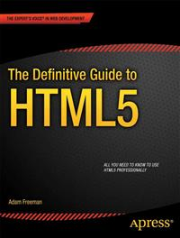
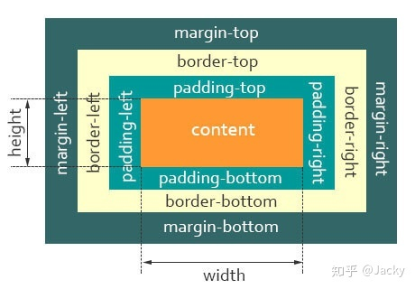
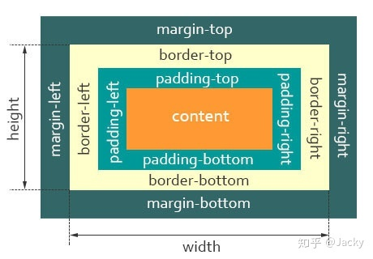
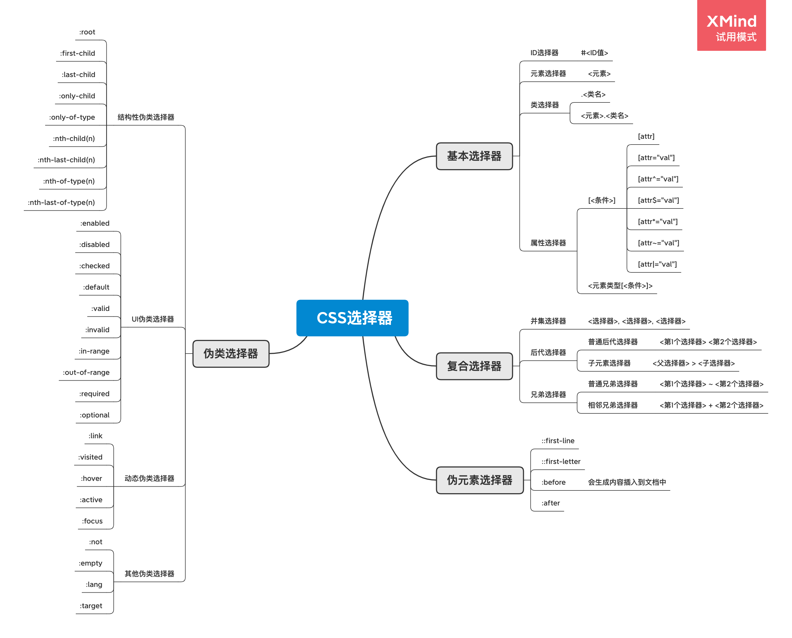
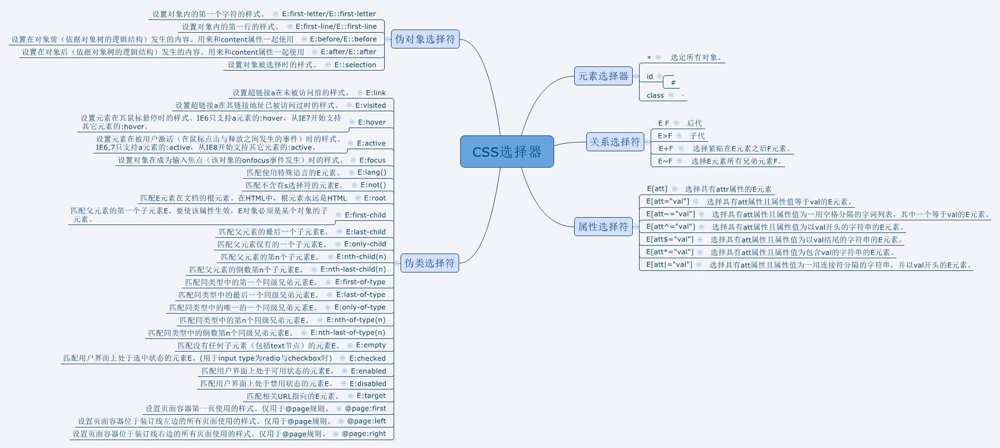

# Apress Source Code

This repository accompanies [*The Definitive Guide to HTML5*](http://www.apress.com/9781430239604) by Adam Freeman (Apress, 2011).



Download the files as a zip using the green button, or clone the repository to your machine using Git.

## Releases

Release v1.0 corresponds to the code in the published book, without corrections or updates.

## Contributions

See the file Contributing.md for more information on how you can contribute to this repository.

# 第一部分: 开篇


# 第3章: 初探HTML

# 第4章: 初探CSS

有关的css

- backgroud-color
- color
- border
- padding


listing-13.html

```css
<style type="text/css">
  a {
  	color: black !important;
  }
</style>
```

# 第5章: 初探JavaScript

```javascript
// 定义对象
var myData = new Object();
myData.name = "Adam";
myData.weather = "sunny";

var myData = {
  name: "Adam",
  weather: "sunny"
};

var myData = {
  name: "Adam",
  weather: "sunny",
  printMessages: function() {
    document.writeln("Hello " + this.name + ". ");
    document.writeln("Today is " + this.weather + ".");        
  }
};

// 数组
var myArray = new Array();
myArray[0] = 100;
myArray[1] = "Adam";
myArray[2] = true;

var myArray = [100, "Adam", true];
```

#    

# 第二部分: HTML元素

# 第6章: HTML5元素背景知识

## 元素选用原则

# 第7章: 创建HTML文档

```html
<!DOCTYPE>
<html>
  <head>
    <title></title>
    <!-- 基础的href, 其他的所有href默认都会加上这个前缀 -->
    <!-- 设置用做html文档中的相对url解析基础的url-->
    <!--<base href="http://titan/listings/"/>-->
    <!-- -->
    <meta name="author" content="Adam Freeman"/>
    <meta name="description" content="A simple example"/>
    <!-- 声明字符编码-->
    <meta charset="utf-8"/>
    <!-- 设置HTML文档的默认样式表或周期性地刷新页面内容 -->
    <meta http-equiv="refresh" content="5"/>
    <!-- 为页面定义网站标识 -->
    <link rel="shortcut icon" href="favicon.ico" type="image/x-icon" />
    <!-- 预先获取资源 -->
    <link rel="prefetch" href="/page2.html"/>
    
    <!-- -->
    <link rel="stylesheet" type="text/css" href="styles.css"/>
    <style media="screen AND (max-width:500px)" type="text/css">
      a {
        background-color: grey;
        color: white;
        padding: 0.5em;
      }
    </style>
    <style media="print AND (min-width:500px)" type="text/css">
      a {color:Red; font-style:italic}
    </style>
    
    <!-- -->
    <script src="simple.js"></script>
    <!-- listing-24.html -->
    <script async src="simple2.js"></script>
    <!-- defer属性告诉浏览器要等页面载入和解析完毕之后才能执行脚本 -->
    <!-- listing-21.html / listing-22.html / listing-23.html -->
    <script defer src="simple2.js"></script>
    <!-- -->
    <noscript>
      <h1>Javascript is required!</h1>
      <p>You cannot use this page without Javascript</p>
    </noscript>
    <!-- 浏览器在不支持JavaScript的时候将其引至另外一个url -->
    <noscript>
      <meta http-equiv="refresh" content="0; http://www.apress.com"/>
    </noscript>
    <script>
      document.write("This is from the script");
    </script>
  </head>
  
  <body>
    <script src="simple2.js"></script>
  </body>
</html>
```

# 第8章: 标记文字

## 8.1 生成超链接

```html
<a href="http://en.wikipedia.org/wiki/Orange_(fruit)">oranges</a>
<a href="fruitlist.html">here</a>
<a href="#fruits">here</a>
```


## 8.2 用基本的文字元素标记内容

```html
<em>I</em>
<b>apples</b>
<i>citrus reticulata</i>
<strong>Warning:</strong>
<small>(plus tax)</small>
<u>too many</u>
x<sub>10</sub>
10<sup>th</sup>
```


## 8.3 换行

```html
<br/>
Super<wbr>califragilistic<wbr>expialidocious.
```


## 8.4 表示输入与输出

```html
<code>var fruits = ["apples", "oranges", "mangoes", "cherries"];<br>
document.writeln("I like " + fruits.length + " fruits");</code>

<var>fruits</var>

<samp>I like 4 fruits</samp>
<kbd>cherries</kbd>
```


## 8.5 使用标题引用, 引文, 定义和缩写

```html
<abbr title="Florida Department of Citrus">FDOC</abbr>
<dfn title="apple">apple</dfn>

<q cite="http://en.wikipedia.org/wiki/Apple">The 
<dfn title="apple">apple</dfn> is the pomaceous fruit of the apple tree,
species Malus domestica in the rose family.</q>

<cite>Fruit: Edible, Inedible, Incredible</cite>
```


## 8.6 使用语言元素


## 8.7 其他文本元素

# 第9章: 组织内容

```html
<p></p>

<div>
</div>

<pre></pre>

<code></code>

<blockquote>  
</blockquote>

<ol>
  <li></li>
</ol>

<ul>
  <li></li>
</ul>

<!-- dl: definition list -->
<!-- dt: definition title -->
<!-- dd: definition detail -->
<dl>
  <dt></dt>
  	<dd></dd>
</dl>

<figure>
  <figcaption>Listing 23. Using the code element</figcaption>
  <code>var fruits = ["apples", "oranges", "mangoes", "cherries"];<br>
    document.writeln("I like " + fruits.length + " fruits");
  </code>
</figure>
```

# 第10章: 文档分节

```html
<hgroup></hgroup>

<section></section>

```

 # 第11章: 表格元素

```html
<table>
  <caption></caption>
  <colgroup id="colgroup1">
    <col id="col1And2" span="2"/>
    <col id="col3"/>
  </colgroup>
  <colgroup id="colgroup2" span="2"/>
  <thead>
    <tr><th id="first" headers="rank"></th></tr>
  </thead>
  <tdoby>
    <tr><td colspan="2" rowspan="2"></td></tr>
  </tdoby>
  <tfoot>
    <tr><td></td></tr>
  </tfoot>
</table>
```

# 第12章: 表单

```html
<form autocomplete="off" target="_blank" method="post" action="">
  <fieldset>
    <legend>Enter Your Details</legend>
    <p><label for="name">Name: <input id="name" name="name"/></label></p>
    <p><label for="name">City: <input id="city" name="city"/></label></p>
  </fieldset>
	<button type="submit" formaction="http://titan:8080/form" formmethod="post" formtarget="_blank">
    Submit Vote
  </button>
  <button type="reset">Reset</button>
</form>
```

# 第13章: 定制input元素

```html
<input size="10" maxlength="10" id="name" name="name" value="Apple" placeholder="Your name" readonly disabled/>

<input type="submit" value="Submit Vote"/>
<input type="reset" value="Reset Form"/>
<input type="button" value="My Button"/>
<input type="number" step="1" min="0" max="100" value="1" id="price" name="price"/>
<input type="range" step="1" min="0" max="100" value="1" id="price" name="price"/>
<input type="checkbox" id="veggie" name="veggie"/>
<input type="radio" value="Oranges" id="oranges" name="fave"/>
<input type="password" placeholder="Min 6 characters" id="password" name="password"/>
<input type="email" placeholder="user@domain.com" id="email" name="email"/>
<input type="tel" placeholder="(XXX)-XXX-XXXX" id="tel" name="tel"/>
<input type="url" id="url" name="url"/>
<input type="date" id="lastbuy" name="lastbuy"/>
<input type="color" id="color" name="color"/>
<input type="search" id="search" name="search"/>
<input type="hidden" name="recordID" value="1234"/>
<!-- 要配合form enctype -->
<form method="post" action="http://titan:8080/form" enctype="multipart/form-data">
<input type="file" name="filedata"/>
</form>
<input type="image" src="accept.png" name="submit"/>

<input list="fruitlist" id="fave" name="fave"/>
<datalist id="fruitlist">
  <option value="Apples" label="Lovely Apples"/>
  <option value="Oranges">Refreshing Oranges</option>
  <option value="Cherries"/>
</datalist>
```

# 第14章: 其他表单元素及输入验证

```html
<!-- 如果option中有label, 优先显示label -->
<select id="fave" name="fave">
  <option value="apples" selected label="Apples">Apples</option>
  <option value="oranges" label="Oranges">Oranges</option>
  <option value="cherries" label="Cherries">Cherries</option>
  <option value="pears" label="Pears">Pears</option>
</select>

<!-- 多选 -->
<select id="fave" name="fave" size="5" multiple>
  <option value="apples" selected label="Apples">Apples</option>
  <option value="oranges" label="Oranges">Oranges</option>
  <option value="cherries" label="Cherries">Cherries</option>
  <option value="pears" label="Pears">Pears</option>
</select>

<select id="fave" name="fave">
  <optgroup label="Top Choices">
    <option value="apples" label="Apples">Apples</option>
    <option value="oranges" label="Oranges">Oranges</option>
  </optgroup>
  <optgroup label="Others">                        
    <option value="cherries" label="Cherries">Cherries</option>
    <option value="pears" label="Pears">Pears</option>
  </optgroup>
</select>

<textarea cols="20" rows="5" wrap="hard" id="story" name="story">Tell us why this is your favorite fruit</textarea>

<input type="email" placeholder="user@mydomain.com" required pattern=".*@mydomain.com$" id="email" name="email"/>

<input type="submit" value="Save" formnovalidate/>
```

# 第15章: 嵌入内容

```html


<map name="mymap">
  <area href="swimpage.html" shape="rect" coords="3,5,68,62" alt="Swimming"/>
  <area href="cyclepage.html" shape="rect" coords="70,5,130,62" alt="Running"/>
  <area href="otherpage.html" shape="default" alt="default"/>
</map>

<embed src="http://www.youtube.com/v/qzA60hHca9s?version=3" type="application/x-shockwave-flash" width="560" height="349" allowfullscreen="true"/>

<object width="560" height="349" 
        data="http://www.youtube.com/v/qzA60hHca9s?version=3"
        type="application/x-shockwave-flash">
  <param name="allowFullScreen" value="true"/>
</object>

<object width="560" height="349" data="http://titan/myimaginaryfile">
  <param name="allowFullScreen" value="true"/>
  <b>Sorry!</b> We can't display this content
</object>

<object data="triathlon.png" type="image/png">
</object>

<progress id="myprogress" value="10" max="100"></progress>
<meter id="mymeter" value="90" min="10" max="100" low="40" high="80" optimum="60"></meter>
```


listing-05.html 与 listing-11.html的区别

# 第三部分: CSS

# 第16章: 理解CSS

## 盒模型

### W3C 盒子模型(标准盒模型)




### IE 盒子模型(怪异盒模型)



## 选择器






# 第17章: 使用CSS选择器(上)


# 第18章: 使用CSS选择器(下)


# 第19章: 使用边框和背景

```css
border-width: 5px;
border-style: solid;
border-color: black;

border-radius: 20px / 15px;
border-radius: 50% 20px 25% 5em / 25% 15px 40px 55%

background-color: lightgray;
background-image: url(banana.png);
background-size: 40px 40px;
background-repeat: repeat;
background-origin: border-box;
background-clip: content-box;

outline: thick solid red;
```


# 第20章: 使用盒模型

```css
display: block;
display: inline;
display: inline-block;
display: run-in;
display: none;
```


# 第21章: 创建布局

```css
top: 5px;
left:150px;
/* static relative absolute fixed*/
position: static;
z-index: 1;

display: table;
display: table-row;
display: table-cell;
```


# 第22章: 设置文本样式

```CSS
white-space: pre-line;
direction: rtl;
word-spacing: 10px;
letter-spacing: 2px;
line-height: 3em;
word-wrap: break-word;
text-indent: 15%;
text-decoration: line-through;
text-transform: uppercase;
text-shadow: 5px 5px 20px black;
font-family: "HelveticaNeue Condensed", monospace;
font-size: larger;
font-weight: bold;
font-style: italic;
```


# 第23章: 过渡, 动画和变换

```css

```


# 第24章: 其他CSS属性和特性

```CSS
color: rgba(255, 255, 255, 0.7);     
opacity: 0.4;
cursor: progress;
```


# 第四部分: 使用DOM

# 第25章: 理解DOM

- Document
- Window
- Position
- History
- DOM CSS
- DOM 事件

# 第26章: 使用Document对象

```javascript
document.getElementById("pressme")
document.getElementsByName("p");
document.getElementsByTagName("p");
document.getElementsByClassName("p");

document.URL
// CSS1Compat
document.compatMode
// 
document.referrer
// document.location
document.location.protocol
//
document.location.hash = "banana";
document.location.assign("http://apress.com");
```


# 第27章: 使用Window对象

```javascript
window.outerWidth;
window.outerHeight;
window.innerWidth;
window.innerHeight;
window.screen.width;
window.screen.height;

window.print();
window.close();
window.scrollTo(0, 400);

window.alert("This is an alert");
window.confirm("This is a confirm - do you want to proceed?");
window.prompt("Enter a word", "hello");
// chrome测试没反应
window.showModalDialog("http://apress.com");

window.history.forward();
window.history.back();
// chrome测试未通过
window.history.go("http://www.apress.com");

// 
window.history.pushState("", "", "?" + e.target.id);
// 示例未运行成功
/* 
listing-08.html:25 Uncaught DOMException: Failed to execute 'pushState' on 'History': A history state object with URL 'file:///Users/jameszou/awesome/awesome-web/Book_The_Definitive_Guide_To_HTML5/Chapter%2027/otherpage.html?banana' cannot be created in a document with origin 'null' and URL 'file:///Users/jameszou/awesome/awesome-web/Book_The_Definitive_Guide_To_HTML5/Chapter%2027/listing-08.html'.
    at HTMLButtonElement.buttons.<computed>.onclick (file:///Users/jameszou/awesome/awesome-web/Book_The_Definitive_Guide_To_HTML5/Chapter%2027/listing-08.html:25:36)
buttons.<computed>.onclick @ listing-08.html:25
*/
// file:///Users/jameszou/awesome/awesome-web/Book_The_Definitive_Guide_To_HTML5/Chapter%2027/otherpage.html?banana 打开正常
window.history.pushState("", "", "otherpage.html?" + e.target.id);

window.history.replaceState("", "", "otherpage?" + e.target.id);

timeoutID = window.setTimeout(funtion(){alert("hello world")}, 5000)
window.clearTimeout(timeoutID);
intervalID = window.setInterval(funtion(){alert("hello world")}, 2000);
window.clearInterval(intervalID);
```

listing-10.html 没看懂

listing-11.html 没看懂

listing-14.html 没看懂

listing-15.html 没看懂


# 第28章: 使用DOM元素

```javascript
element.innerHTML = ""
element.className = ""
element.classList
element.classList.toggle("newclass")
element.hasAttribute("attr")
element.getAttribute("attr")
element.setAttribute("attr", "value")
element.dataset
element.attributes

elment.isSameNode(element2)
elment.isEqualNode(element2)

table_row_element.innerHTML
table_row_element.outerHTML
table_row_element.insertAdjacentHTML("afterbegin", "<td>After Begin</td>");
```


# 第29章: 为DOM元素设置样式

```javascript
document.styleSheets;

style_sheet.href
style_sheet.title
style_sheet.type
// TYPE LINK
style_sheet.ownerNode.tagName
style_sheet.media.length
style_sheet.media.mediaText
style_sheet.media.item(index)

style_sheet.disabled = true

style_sheet.cssRules
```

listing-04.html 有些没看懂

# 第30章: 使用事件

```javascript
onmouseover
onmouseout
onfocus
onblur

```


# 第31章: 使用元素专属对象


# 第五部分: 高级功能

# 第32章: 使用Ajax(第1部分)


# 第33章: 使用Ajax(第2部分)


# 第34章: 使用多媒体

```html
<video width="360" height="240" src="timessquare.webm"
       autoplay controls preload="none" muted>
  Video cannot be displayed
</video>

<video controls width="360" height="240">
  <source src="timessquare.webm" type="video/webm" />
  <source src="timessquare.ogv" type="video/ogg" />
  <source src="timessquare.mp4" type="video/mp4" />
  Video cannot be displayed
</video>

<audio controls src="mytrack.mp3" autoplay>
  Audio content cannot be played
</audio>
```


# 第35章: 使用canvas元素(第1部分)

```javascript
var ctx = document.getElementById("canvas").getContext("2d");
ctx.fillRect();
ctx.strokeRect();

```


# 第36章: 使用canvas元素(第2部分)


# 第37章: 使用拖放


# 第38章: 使用地理定位

```javascript
navigator.geolocation.watchPosition(displayPositionFuction, handleErrorFunction, options);
```


# 第39章: 使用web存储

```javascript
localStorage.setItem(key, value);
localStorage.clear();
localStorage.length;
var key = localStorage.key(i);
localStorage[key];

sessionStorage.setItem(key, value);
sessionStorage.clear();
sessionStorage.length;
var key = sessionStorage.key(i);
sessionStorage[key];
```


# 第40章: 创建离线web应用程序

```javascript
window.navigator.onLine
```

