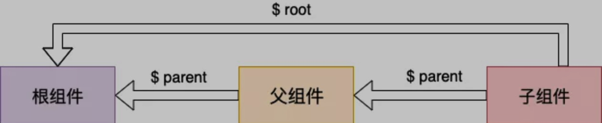

# 说明

本教程根据vue.js的学习教程制作而成

根据学习内容编织相应的示例, 来辅助学习

# 基础

## 组件

因为组件是可复用的 Vue 实例，所以它们与 `new Vue` 接收相同的选项，例如 `data`、`computed`、`watch`、`methods` 以及生命周期钩子等。仅有的例外是像 `el` 这样根实例特有的选项。

组件中的data不能是一个对象

```
data: {
  count: 0
}
```

这个时候报错

```
vue.min.js:6 ReferenceError: counter is not defined
    at o.eval (eval at xa (vue.min.js:6), <anonymous>:3:99)
    at o.fn._render (vue.min.js:6)
    at o.i (vue.min.js:6)
    at St.get (vue.min.js:6)
    at new St (vue.min.js:6)
    at o.hn.$mount (vue.min.js:6)
    at o.hn.$mount (vue.min.js:6)
    at init (vue.min.js:6)
    at vue.min.js:6
    at b (vue.min.js:6)
```


组件中的data必须是一个函数

```
data: function () {
  return {
    count: 0
  }
}
```

### 通过 Prop 向子组件传递数据

03_props.html

04_props_variable.html

05_props_for.html

### 单个根元素

 **every component must have a single root element (每个组件必须只有一个根元素)**

一般将模版包含在<div></div>中

06_props_object.html

### 监听子组件事件

07_props_emit.html

08_props_emit_event.html

在组件上使用v-model

10_props_v-model2.html

### 通过插槽分发内容

11_props_slot.html

### 动态组件

12_dynamic.html

```
<!-- 组件会在 `currentTabComponent` 改变时改变 -->
<component v-bind:is="currentTabComponent"></component>
```

### 解析dom模版时候的注意事项

13_nest_tr.html

14_nest_tr.html

# 深入理解组件

## 组件注册

### 组件名

#### 使用 kebab-case

```
'my-component-name'
```

#### 使用 PascalCase

```
'MyComponentName'
```

引用时候`<my-component-name>` 和 `<MyComponentName>` 都是可接受的

### 全局注册

```
Vue.component('my-component-name', {
  // ... 选项 ...
})
```

### 局部注册

```javascript
<div id="app">
  <component-a></component-a>
  <component-b></component-b>
  <component-c></component-c>
</div>

<script type="text/javascript">
	...
  let ComponentA = { /* ... */ }
  let ComponentB = { /* ... */ }
  let ComponentC = { /* ... */ }
	...
  new Vue({
    el: '#app',
    components: {
      'component-a': ComponentA,
      'component-b': ComponentB,
      'component-c': ComponentC
    }
  })
</script>
```

组件复用

```javascript
var ComponentA = { /* ... */ }

var ComponentB = {
  components: {
    'component-a': ComponentA
  },
  // ...
}
```

ES2015写法如下

```javascript
import ComponentA from './ComponentA.vue'

export default {
  components: {
    ComponentA
  },
  // ...
}
```

### 模块系统

局部注册

ComponentB.vue文件中使用ComponentA.vue和ComponentC.vue

```javascript
import ComponentA from './ComponentA'
import ComponentC from './ComponentC'

export default {
  components: {
    ComponentA,
    ComponentC
  },
  // ...
}
```

全局注册

如果你恰好使用了 webpack (或在内部使用了 webpack 的 [Vue CLI 3+](https://github.com/vuejs/vue-cli))，那么就可以使用 `require.context` 只全局注册这些非常通用的基础组件。

**全局注册的行为必须在根 Vue 实例 (通过 `new Vue`) 创建之前发生**

示例

https://github.com/chrisvfritz/vue-enterprise-boilerplate/blob/master/src/components/_globals.js

## prop

### 大小写

HTML 中的 attribute 名是大小写不敏感的，所以浏览器会把所有大写字符解释为小写字符

#### kebab-case

```
Vue.component('blog-post', {
  // 在 JavaScript 中是 camelCase 的
  props: ['post-title'],
  template: '<h3>{{ post-title }}</h3>'
})
'component-prop1'
```


#### camelCase

```
Vue.component('blog-post', {
  // 在 JavaScript 中是 camelCase 的
  props: ['postTitle'],
  template: '<h3>{{ postTitle }}</h3>'
})
```

引用必须使用 kebab-case

```
<!-- 在 HTML 中是 kebab-case 的 -->
<blog-post post-title="hello!"></blog-post>
```


### 类型

```
props: {
  title: String,
  likes: Number,
  isPublished: Boolean,
  commentIds: Array,
  author: Object,
  callback: Function,
  contactsPromise: Promise // or any other constructor
}
```

### 传递prop

传入数字

传入布尔值

​	使用is-published做prop名字会发生错误

### 单向数据流

父级 prop 的更新会向下流动到子组件中，但是反过来则不行。这样会防止从子组件意外变更父级组件的状态，从而导致你的应用的数据流向难以理解。

```javascript
props: ['initialCounter'],
data: function () {
  return {
    counter: this.initialCounter
  }
}
```


```javascript
props: ['size'],
computed: {
  normalizedSize: function () {
    return this.size.trim().toLowerCase()
  }
}
```

### prop验证

## 非 Prop 的 Attribute

## 自定义事件

`v-on` 事件监听器在 DOM 模板中会被自动转换为全小写 

自定义组件的v-model

01_v-model.html

02_v-model.html

03_v-model.html

### 将原生事件绑定到组件

这个没有看明白, 示例没有设计成功

04_bind.html

### .sync修饰符

没看明白， 示例 05_sync.html 没设计好

## 插槽

### 编译作用域

**父级模板里的所有内容都是在父级作用域中编译的；子模板里的所有内容都是在子作用域中编译的。**

### 作用域插槽

让插槽内容访问子组件中的数据

插槽prop

```javascript
// componnet
<span>
  <slot v-bind:user="user">
    {{ user.lastName }}
  </slot>
</span>
```

```javascript
// 父级
<current-user>
  <template v-slot:default="slotProps">
    {{ slotProps.user.firstName }}
  </template>
</current-user>
```

作用域插槽的内部工作原理是将你的插槽内容包裹在一个拥有单个参数的函数里：

### 动态插槽名

v-slot` 也有缩写，即把参数之前的所有内容 (`v-slot:`) 替换为字符 `#

```xml
<base-layout>
  <template #header>
    <h1>Here might be a page title</h1>
  </template>

  <p>A paragraph for the main content.</p>
  <p>And another one.</p>

  <template #footer>
    <p>Here's some contact info</p>
  </template>
</base-layout>
```


## 动态组件&异步组件

keep-alive

### 异步组件

在大型应用中，我们可能需要将应用分割成小一些的代码块，并且只在需要的时候才从服务器加载一个模块。为了简化，Vue 允许你以一个工厂函数的方式定义你的组件，这个工厂函数会异步解析你的组件定义。Vue 只有在这个组件需要被渲染的时候才会触发该工厂函数，且会把结果缓存起来供未来重渲染


## 处理边界情况

一些需要对 Vue 的规则做一些小调整的特殊情况

### 访问元素&组件

在绝大多数情况下，我们最好不要触达另一个组件实例内部或手动操作 DOM 元素。不过也确实在一些情况下做这些事情是合适的。

#### 访问根实例

```javascript
// Vue 根实例
// 在每个 new Vue 实例的子组件中，其根实例可以通过 $root property 进行访问
new Vue({
  data: {
    foo: 1
  },
  computed: {
    bar: function () { /* ... */ }
  },
  methods: {
    baz: function () { /* ... */ }
  }
})
```

所有的子组件都可以将这个实例作为一个全局 store 来访问或使用。

```javascript
// 获取根组件的数据
this.$root.foo

// 写入根组件的数据
this.$root.foo = 2

// 访问根组件的计算属性
this.$root.bar

// 调用根组件的方法
this.$root.baz()
```

#### 访问父级组件实例

`$parent` property 可以用来从一个子组件访问父组件的实例



#### 访问子组件实例或子元素

通过 `ref` 这个 attribute 为子组件赋予一个 ID 引用

```javascript
// 子组件定义
<base-input ref="usernameInput"></base-input>

// 父组件调用
this.$refs.usernameInput

// $refs 只会在组件渲染完成之后生效，并且它们不是响应式的。这仅作为一个用于直接操作子组件的“逃生舱”
// 你应该避免在模板或计算属性中访问 $refs。
```

#### 依赖注入

```javascript
// provide 选项允许我们指定我们想要提供给后代组件的数据/方法
provide: function () {
  return {
    getMap: this.getMap
  }
}

// 在任何后代组件里，我们都可以使用 inject 选项来接收指定的我们想要添加在这个实例上的 property：
inject: ['getMap']

// 相比 $parent 来说，这个用法可以让我们在任意后代组件中访问 getMap，而不需要暴露整个 <google-map> 实例
```


实际上，你可以把依赖注入看作一部分“大范围有效的 prop”，除了：

- 祖先组件不需要知道哪些后代组件使用它提供的 property
- 后代组件不需要知道被注入的 property 来自哪里

### 程序化的事件监听器

- 通过 `$on(eventName, eventHandler)` 侦听一个事件
- 通过 `$once(eventName, eventHandler)` 一次性侦听一个事件
- 通过 `$off(eventName, eventHandler)` 停止侦听一个事件

你通常不会用到这些，但是当你需要在一个组件实例上手动侦听事件时，它们是派得上用场的

### 循环引用

https://www.jb51.net/article/131619.htm

### 模版定义的替代品

#### inline-template

```xml
<my-component inline-template>
  <div>
    <p>These are compiled as the component's own template.</p>
    <p>Not parent's transclusion content.</p>
  </div>
</my-component>
```

#### x-template

```html
<script type="text/x-template" id="hello-world-template">
  <p>Hello hello hello</p>
</script>
```

```javascript
Vue.component('hello-world', {
  template: '#hello-world-template'
})
```


### 控制更新

如果你发现你自己需要在 Vue 中做一次强制更新，99.9% 的情况，是你在某个地方做错了事。

[`$forceUpdate`](https://cn.vuejs.org/v2/api/#vm-forceUpdate)

通过 `v-once` 创建低开销的静态组件, 你可以在根元素上添加 `v-once` attribute 以确保这些内容只计算一次然后缓存起来，就像这样：

```javascript
Vue.component('terms-of-service', {
  template: `
    <div v-once>
      <h1>Terms of Service</h1>
      ... a lot of static content ...
    </div>
  `
})
```


# 过渡&动画

## 单元素/组件的过渡


# 可复用性&组合

## 混入

### 自定义选项合并策略

没有看懂


## 自定义指令

```javascript
// 注册一个全局自定义指令 `v-focus`
Vue.directive('focus', {
  // 当被绑定的元素插入到 DOM 中时……
  inserted: function (el) {
    // 聚焦元素
    el.focus()
  }
})

```

```javascript
directives: {
  focus: {
    // 指令的定义
    inserted: function (el) {
      el.focus()
    }
  }
}
```


```javascript
// v-demo:foo.a.b="message" foo.a.b是什么东西?
<div id="hook-arguments-example" v-demo:foo.a.b="message"></div>

Vue.directive('demo', {
  // bind：只调用一次，指令第一次绑定到元素时调用。在这里可以进行一次性的初始化设置。
  bind: function (el, binding, vnode) {
    var s = JSON.stringify
    el.innerHTML =
      'name: '       + s(binding.name) + '<br>' +
      'value: '      + s(binding.value) + '<br>' +
      'expression: ' + s(binding.expression) + '<br>' +
      'argument: '   + s(binding.arg) + '<br>' +
      'modifiers: '  + s(binding.modifiers) + '<br>' +
      'vnode keys: ' + Object.keys(vnode).join(', ')
  }
  // el：指令所绑定的元素，可以用来直接操作 DOM。
  // name：指令名，不包括 v- 前缀。
  // name: "demo"
  // value：指令的绑定值，例如：v-my-directive="1 + 1" 中，绑定值为 2
  // value: "hello!"
  // oldValue：指令绑定的前一个值，仅在 update 和 componentUpdated 钩子中可用。无论值是否改变都可用。
  // expression：字符串形式的指令表达式。例如 v-my-directive="1 + 1" 中，表达式为 "1 + 1"
  // expression: "message"
  // arg：传给指令的参数，可选。例如 v-my-directive:foo 中，参数为 "foo"。
  // argument: foo
  // modifiers：一个包含修饰符的对象。例如：v-my-directive.foo.bar 中，修饰符对象为 { foo: true, bar: true }
  // modifiers: {"a": true, "b": true}
  // vnode：Vue 编译生成的虚拟节点。移步 VNode API 来了解更多详情。
  // vnode keys: 
  // oldVnode：上一个虚拟节点，仅在 update 和 componentUpdated 钩子中可用。
})


new Vue({
  el: '#hook-arguments-example',
  data: {
    message: 'hello!'
  }
})
```


## 渲染函数 & JSX

Vue 推荐在绝大多数情况下使用模板来创建你的 HTML。然而在一些场景中，你真的需要 JavaScript 的完全编程的能力。这时你可以用**渲染函数**，它比模板更接近编译器

### 节点, 树及虚拟DOM

Vue 通过建立一个**虚拟 DOM** 来追踪自己要如何改变真实 DOM

“虚拟 DOM”是我们对由 Vue 组件树建立起来的整个 VNode 树的称呼。

### createElement参数

```javascript
// @returns {VNode}
createElement(
  // {String | Object | Function}
  // 一个 HTML 标签名、组件选项对象，或者
  // resolve 了上述任何一种的一个 async 函数。必填项。
  'div',

  // {Object}
  // 一个与模板中 attribute 对应的数据对象。可选。
  {
    // (详情见下一节)
  },

  // {String | Array}
  // 子级虚拟节点 (VNodes)，由 `createElement()` 构建而成，
  // 也可以使用字符串来生成“文本虚拟节点”。可选。
  [
    '先写一些文字',
    createElement('h1', '一则头条'),
    createElement(MyComponent, {
      props: {
        someProp: 'foobar'
      }
    })
  ]
)
```


### 使用JavaScript代替模版功能


### JSX

JSX是一种JavaScript的语法扩展，运用于[React](https://baike.baidu.com/item/React/18077599)架构中，其格式比较像是模版语言，但事实上完全是在[JavaScript](https://baike.baidu.com/item/JavaScript/321142)内部实现的。

### 函数式组件

```javascript
Vue.component('my-component', {
  functional: true,
  // Props 是可选的
  props: {
    // ...
  },
  // 为了弥补缺少的实例
  // 提供第二个参数作为上下文
  render: function (createElement, context) {
    // ...
  }
})
```

因为函数式组件只是函数，所以渲染开销也低很多。

**没太看明白, 需要再次研读**

### 模版编译

Vue 的模板实际上被编译成了渲染函数


## 插件

```
// 调用 `MyPlugin.install(Vue)`
Vue.use(MyPlugin, { someOption: true })

new Vue({
  // ...组件选项
})
```

[awesome-vue](https://github.com/vuejs/awesome-vue#components--libraries) 集合了大量由社区贡献的插件和库。

## 过滤器

# 工具

**关注点分离不等于文件类型分离**

在现代 UI 开发中，我们已经发现相比于把代码库分离成三个大的层次并将其相互交织起来，把它们划分为松散耦合的组件再将其组合起来更合理一些

在一个组件里，其模板、逻辑和样式是内部耦合的，并且把他们搭配在一起实际上使得组件更加内聚且更可维护。

# 规模化

## 路由

vue-router

https://router.vuejs.org/zh/

## 状态管理

类 Flux 状态管理的官方实现 - vuex

https://vuex.vuejs.org/zh/

要仔细理解[Flux](https://facebook.github.io/flux/) 架构

### 服务器端渲染


# 内在

## 深入响应式原理

