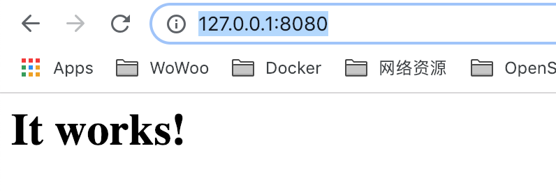
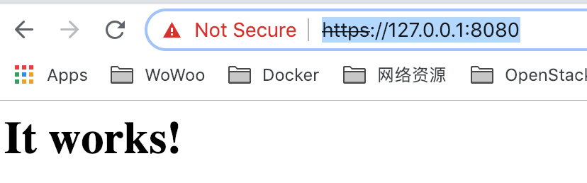

# 基础知识

HTTP的相关基础技术

# HTTP2

## 创建HTTP2服务器

### 说明

创建HTTP2服务器主要包含如下几步

1. 下载并安装TLS证书
2. 下载并安装支持HTTP2的Web服务器
3. 浏览器和服务器通过HTTP2连接

### 下载并安装TLS证书

创建证书有3种方式

1. 自己创建
2. 在线证书生成器
3. 数字证书认证机构申请证书

#### 自己创建

通过openssl创建自签名证书

```
$ openssl genrsa -out privkey.pem 2048
Generating RSA private key, 2048 bit long modulus
....................................+++
....+++
e is 65537 (0x10001)
```

```
$ openssl req -new -x509 -sha256 -key privkey.pem -out cert.pem -days 365 -subj "/CN=natrix.creditease.cn"
```

这样你生成了私钥 privkey.pem 和新证书 cert.pem

#### 在线证书生成器

许多

#### 数字证书认证机构

Let's Encrypt

需要域名，没有验证

### 安装并运行HTTP2服务器

使用nghttp2

nghttp2 是一个用 C 实现的 HTTP/2 库，支持 h2c。它可以做为其它软件的一部分，为其提供 HTTP/2 相关功能（例如 curl 的 HTTP/2 功能就是用的 nghttp2）。除此之外，它还提供了四个有用的 HTTP/2 工具：

- nghttp：HTTP/2 客户端；
- nghttpd：HTTP/2 服务端；
- nghttpx：HTTP/2 代理，提供 HTTP/1、HTTP/2 等协议之间的转换； 
- h2load：HTTP/2 性能测试工具；　

#### mac安装

```
brew install nghttp2
```

#### 创建一个简易网站

##### mac

安装httpd

```
$ brew install httpd
DocumentRoot is /usr/local/var/www.

The default ports have been set in /usr/local/etc/httpd/httpd.conf to 8080 and in
/usr/local/etc/httpd/extra/httpd-ssl.conf to 8443 so that httpd can run without sudo.

To have launchd start httpd now and restart at login:
  brew services start httpd
Or, if you don't want/need a background service you can just run:
  apachectl start
```

启动

```
$ apachectl start
AH00557: httpd: apr_sockaddr_info_get() failed for bogon
AH00558: httpd: Could not reliably determine the server's fully qualified domain name, using 127.0.0.1. Set the 'ServerName' directive globally to suppress this message
```

检验

http://127.0.0.1:8080/



#### 运行

nghttpd 语法如下

```
nghttpd -v -d <webroot> <port> <key> <cert>
```

webroot是你网站的路径

```
$ nghttpd -v -d /usr/local/var/www/ 8080 privkey.pem cert.pem
IPv6: listen :::8080
IPv4: listen 0.0.0.0:8080
```

#### 验证

http://127.0.0.1:8080/




