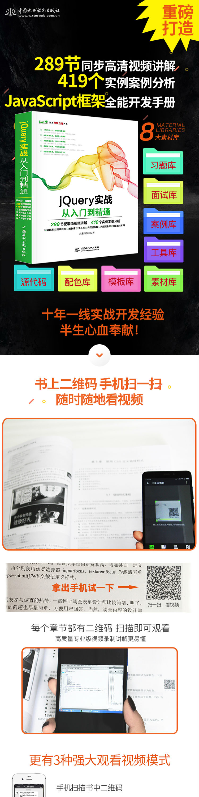

# 书籍介绍

**jQuery实战从入门到精通 web前端开发网页设计丛书**

- 出版社： [中国水利水电出版社](https://book.jd.com/publish/中国水利水电出版社_1.html)
- ISBN：9787517054115
- 版次：1
- 商品编码：12222954
- 品牌：[中国水利水电出版社](https://www.jd.com/pinpai/1-1713-447808.html)
- 包装：平装
- 丛书名： [Web开发视频点播大系](https://search.jd.com/Search?keyword=Web开发视频点播大系&book=y)
- 开本：16开
- 出版时间：2017-07-01
- 用纸：胶版纸
- 页数：556
- 正文语种：中文



https://item.jd.com/12222954.html

# 第1章: JQuery基础

```javascript
var li = document.getElementsByTagName("li");		//获取所有li元素
var $lis = $(li);			//把所有li元素封装为jQuery对象
var $li = $(li[0]);				//把第一个li元素封装为jQuery对象
alert($li.html());				//调用jQuery对象的方法
```

# 第2章: 使用选择器

## 2.1 选择器基础

## 2.2 基本选择器

### ID选择器

### 类型选择器

### 类选择器

### 通配符选择器

```javascript
$("body *").css("color","red");
```

### 分组选择器

```javascript
$("h2, #wrap, span.red, [title='text'").css("color","red");
```

## 2.3 结构选择器

结构选择器就是根据HTML文档中节点之间的包含或并列关系决定匹配元素的一种方法

模仿CSS关系过滤模式

### 层级选择器

```javascript
// 包含选择器
$("form input").css({"border":"solid 1px red","background":"blue"});
// 子选择器
$("div > img").css("border","solid 5px red");
// 相邻选择器
$("div + img").css("border","solid 5px red");
// 兄弟选择器
$("div ~ img").css("border","solid 5px red");

```

### 子元素选择器

- :nth-child

  ```javascript
  // 偶数
  $("li:nth-child(even)")
  // 奇数
  $("li:nth-child(odd)")
  // 第1个
  $("li:nth-child(1)")
  // 每隔2个匹配
  $("li:nth-child(2n)")
  ```

- :first-child

- :last-child

- :only-child

## 2.4 过滤选择器

通过特定的过滤表达式来筛选特殊需求的DOM元素

### 定位过滤器

```javascript
$("tr:first").css("color", "red");        	//设置第1行字体为红色
$("tr:eq(0)").css("font-size", "20px");   	//设置第1行字体大小为20像素
$("tr:last").css("color", "blue");       	//设置最后一行字体为蓝色
$("tr:even").css("background", "#ffd"); 	//设置偶数行背景色
$("tr:odd").css("background", "#dff"); 	//设置奇数行背景色
$("tr:gt(3)").css("font-size", "12px");  	//设置从第5行开始所有行的字体大小
$("tr:lt(4)").css("font-size", "14px");   	//设置从第1～4行字体大小
```

### 内容过滤器

```javascript
$("li:empty").text("空内容");    			//匹配空li元素
// parent 匹配含有子元素或文本的元素
$("div ul:parent").css("background", "#ff1");  	//匹配div包含ul元素中包含子元素或者文本元素
$("h2:contains('标题')").css("color", "red");  	//标题元素中包含“标题”文本内容的
$("p:has(span)").css("color", "blue");       	//包含span元素的p元素
```

### 可见过滤器

```javascript
$("p:odd").hide();               	//隐藏奇数位p元素
$("p:visible").css("color", "blue");    	//设置偶数位p元素的字体颜色为蓝色
$("p:hidden").show();              	//显示奇数位p元素
```

## 2.5 属性选择器

- [attribute] 包含属性
- [attribute=valaue]
- [attribute!=value]
- [attribute^=value] 属性以某些值开始
- [attribute$=value] 属性以某些值结尾
- [attribute*=value] 属性包含某些值
- \[selector1\]\[selector2\]\[selectorN]

```javascript
var a1 = $("a[href$='.pdf']");
var a3 = $("a[href$='.jpg'],a[href$='.bmp'],a[href$='.gif'],a[href$='.png']");
var a4 = $("a[href^='http:']");
```

## 2.6 表单选择器

### 基本选择器

```javascript
<!doctype html>
<html>
<head>
<meta charset="utf-8">
<script src="jquery/jquery-3.1.1.js" type="text/javascript"></script>
<script type="text/javascript">
$(function(){
    $("#test :text").val("修改后的文本域");
    $("#test :password").val("修改后的密码域");
    $("#test :checkbox").val("修改后的复选框");
    $("#test :radio").val("修改后的单选按钮");    
    $("#test :image").val("修改后的图像域");    
    $("#test :file").val("修改后的文件域");    
    $("#test :hidden").val("修改后的隐藏域");
    $("#test :button").val("修改后的普通按钮");
    $("#test :submit").val("修改后的提交按钮");
    $("#test :reset").val("修改后的重置按钮");
})
</script>
<style type="text/css">
a img { border:none;}
</style>
<title></title>
</head>
<body>
<form id="test" action="" method="get">
    <input name="" type="text" value="文本域"><br />
    <input name="" type="password" value="密码域"><br />
    <input name="" type="checkbox" value="复选框">复选框<br />
    <input name="" type="radio" value="单选按钮">单选按钮<br />
    <input name="" type="image" value="图像域" src="images/btn.png"S><br />
    <input name="" type="file" value="文件域"><br />
    <input name="" type="hidden" value="隐藏域"><br />
    <input name="" type="button" value="普通按钮"><br />
    <input name="" type="submit" value="提交按钮"><br />
    <input name="" type="reset" value="重置按钮"><br />
</form>
</body>
</html>
```

### 高级表单选择器

```javascript
$("#test :disabled").val("不可用");
$("#test :enabled").val("可用");
$("#test :checked").removeAttr("checked");
$("#test :selected").removeAttr("selected");
```

## 2.7 选择器优化

速度考虑

ID选择器(getElementById) > 类型选择器(getElementByTag) >  类选择器(先解析HTML文档树, 并且需要在浏览器内核外递归)

优化建议

- 多用ID选择器

- 少直接使用CLASS选择器

- 多用父子关系, 少用嵌套关系

  使用parent>child代替parent child, 因为>不递归

- 缓存jQuery对象

## 2.8 使用原生选择器

DOM API的核心方法

- querySelector()
- querySelectorAll()

NodeSelctor接口可以使用上面方法, 实现了NodeSelector接口的有

- Document
- DocumentFragment
- Element

```javascript
var l1 = document.querySelector(".content ul li");
var lis =  document.querySelectorAll(".content ul li");
```

# 第3章: 使用过滤器

## 3.1 过滤

### 类过滤

```javascript
$("#div1").hasClass("red")
```

### 下标过滤

```javascript
// 第2个div元素
$("div").eq(1)
```

### 表达式过滤

```javascript
$("div").filter(".red")
// p下有2个span, $("span", this)匹配当前元素内部的所有span元素
$("p").filter(function(index) {
		return $("span", this).length == 2;
}) 
$("p").has("span.red")
```

### 判断

```javascript
is(expr)
```

### 映射

```javascript
map(callback)
```

```javascript
$("input").map(function(){
			return $(this).val();
}).get().join("、 ") 
```

### 清除

```javascript
$("#menu li").not(".home")
```

### 截取

```javascript
//截取第3、4个菜单项
//注意, 是从1开始, 而不是从0开始
$("#menu li").slice(2,4)
```

## 3.2 查找

### 向下查找

```javascript
$("#menu").children()
$("#menu").children(".home")
```

```javascript
<!doctype html>
<html>
<head>
<meta charset="utf-8">
<script src="jquery/jquery-3.1.1.js" type="text/javascript"></script>
<script type="text/javascript">
$(function(){
  	var j = $("body > div");
  	// children()仅仅能够查找子元素
  	alert(j.children("div").length);	//返回3个div元素
  	// find能够查找所有后代元素
  	alert(j.find("div").length); 	//返回5个div元素
  	// contents不仅可以获取子元素, 还可以获取文本节点和注释节点
  	alert(j.contents().length); 	//返回7个元素，包括5个div元素，2个文本节点（空格）
})
</script>
<title></title>
</head>
<body>
<div>
    <div>
        <div></div>
        <div>  </div>
    </div>
    <div></div>
    <div></div>
</div>
</body>
</html>
```

### 向上查找

- parents()
- parent()
- parentsUntil()
- offsetParent() 查找到当前元素最近的定位包含框
- closet() 查找指定的父元素

### 向前查找

- prev()
- prevAll()
- prevUntil()

### 向后查找

- next()
- nextAll()
- nextUntil()

### 查找同辈元素

- siblings()

### 添加查找

```javascript
// add()方法可以为查找的结果集添加新的查找内容
$(".red").siblings("p").add("h1,h2").css("border","solid 1px red");
```

## 3.3 串联

### 合并jQuery对象

```javascript
// addBack()方法帮助用户把前后jQuery对象合并在一起, 形成一个新的jQuery对象
$("div").find("p").addBack().css({"border":"solid 1px red","margin":"4px"});
```

### 返回jQuery对象

```javascript
// 调用end()方法返回$("div")方法匹配的jQuery对象, 而不是find()方法锁查找的jQuery
$("div").find("p").css({"border":"solid 1px #fff","margin":"4px"}).end().css({"background":"blue","color":"white","padding":"4px"});
```

# 第4章: 操作DOM

DOM操作可分为3个方面

- DOM Core 核心
- HTML DOM
- CSS DOM

## 4.1 创建节点

### 创建元素

createElement

```javascript
var div = document.createElement("div");//创建div元素
document.body.appendChild(div); 	//把创建的div元素添加到DOM文档树中

var $div = $("<div></div>");	//创建div对象
$("body").append($div); 	//把创建的div对象添加到文档中
```

### 创建文本

createTextNode

```javascript
var div = document.createElement("div");
var txt = document.createTextNode("DOM");
div.appendChild(txt);
document.body.appendChild(div);

var $div = $("<div>DOM</div>");
$("body").append($div);
```

### 创建属性

```javascript
setAttribute(name, value)
```

## 4.2 插入节点

### 内部插入

- appendChild()
- insertBefore()
- append() 插入到匹配元素里面的最后面
- appendTo(target) 将匹配元素插入到目标元素的最后面
- prepend()
- prependTo()

```html
<!doctype html>
<html>
<head>
<meta charset="utf-8">
<script type="text/javascript" >
window.onload = function(){
    var div = document.getElementsByTagName("div")[0];
    var h1 = document.createElement("h1");	
    var o = div.insertBefore(h1,div.firstChild); 
}
</script>
</head>
<body>
<div>
    <p>段落文本</p>
</div>
</body>
</html>
```

插入之后html变成了

```html
<body>
<div>
  	<h1></h1>
    <p>段落文本</p>
</div>
</body>
```

### 外部插入

- after
- before()
- insertAfter()
- insertBefore()

```html
<!doctype html>
<html>
<head>
<meta charset="utf-8">
<script src="jquery/jquery-3.1.1.js" type="text/javascript"></script>
<script type="text/javascript" >
$(function(){ 
    $("li img").after($("li img").attr("src"));
})
</script>
<style type="text/css">
li{ float:left;}
li img { height:200px;}

</style>
</head>
<body>
<ul class="container">
    <li></li>
    <li></li>
</ul>
</body>
</html>
```

插入之后html变成了

```html
<body>
<ul class="container">
    <li>"images/1.jpg"</li>
    <li>"images/2.jpg"</li>
</ul>
</body>
```

如果使用before

```javascript
$("li img").before($("li img").attr("src"));
```

插入之后html变成了

```html
<body>
<ul class="container">
    <li>"images/1.jpg"</li>
    <li>"images/2.jpg"</li>
</ul>
</body>
```

## 4.3 删除节点

- removeChild()
- remove() 返回的结果是移除的节点
- empty() 清空
- detach() 能够将匹配元素从DOM中分离出来

**detach()与remove()区别**

detach()能够保存所有jquery数据与被移走的元素相关联, 所有绑定在元素上的事件，附加的数据等都会保留下来。

## 4.4 复制节点

- cloneNode(include_all) 不拥有事件处理函数, 但拥有事件属性
  - include_all = True, 复制原节点以及所有子节点
  - include_all = False, 仅复制节点本身

- clone()

  如果clone(true)的话, 复制事件处理函数等数据

## 4.5 替换节点

- nodeObject.replaceChild(new_node, old_node)

- replaceWith()

- replaceAll()

  $A.replaceAll($B) = $B.replaceWith($A)

```
p[i].parentNode.replaceChild(div1,p[i]);

$(this).replaceWith("<div>" + $(this).text() + "</div>");

```

## 4.6 包裹元素

### 外包

wrap()

```html
<a href="#">新闻</a>
// 设置外包
$("a").wrap("<li>外包</li>");
// 结果变成了
<li>"外包"<a href="#">新闻</a></li>
```

### 内包

wrapInner()

```html
<a href="#">新闻</a>
// 设置内包
$("a").wrap("<li>内包</li>");
// 结果变成了
<a href="#"><li>"内包""新闻"</li></a>
```

### 总包

wrapAll()

```javascript
// 在所有的li外包一层ul
$("li").wrapAll("<ul></ul>");
```

### 卸包

unwrap()

## 4.7 操作属性

### 设置属性

- prop()
- attr()

注意区别

```javascript
var input = document.getElementsByTagName("input")[0];
// DOM方法
input.setAttribute("title","段落文本");
input.prop({disabled: true});
input.attr("src",function(index){ 
          return "images/test.jpg"; 
});
```

### 访问属性

- prop()
- attr()

```javascript
var input = document.getElementsByTagName("input")[0];
// DOM方法
input.getAttribute("title");
input.attr('checked');
input.prop('checked');
input.is(':checked');
```

### 删除属性

```javascript
var p = document.getElementsByTagName("p")[0];
p.removeAttribute("title");
p.removeProp("title");
p.removeAttr("title");
```

## 4.8 操作类

```javascript
// 添加类样式
$("p:last").addClass("selected");
// 删除类样式
$("p:last").removeClass("selected");
// 切换
$("p:last").toggleClass("selected");
// 判断
$("p:last").hasClass("selected");
```

## 4.9 操作内容

```javascript
// 读写HTML字符串
$("div1").innerHTML = "<h1>div1</h1>"
$("div1").html("<h1>div1</h1>")
var divt = $("div1").html()
// 读写文本
var divs = $("#div1").text();
$("#p1").text(divs);
// 读写值
var input1 = $("#input1").val();
$("#input2").val(input1)
```

## 4.10 操作样式表

- css()
- offset() 绝对定位, 获取匹配元素在当前视口的相对偏移
- position() 相对定位, 获取匹配元素的相对偏移位置
- width() / height() 控制大小
- innerWidth() / innerHeight()
- outerWidth() / outerHeight()

## 4.11 遍历文档

- children()
- next()
- prev()
- parent()

# 第5章: 事件处理

事件驱动的核心

- 以消息为基础
- 以事件来驱动

## 5.1 事件基础

### 绑定事件

| 方法                                           | 说明                   |
| ---------------------------------------------- | ---------------------- |
| bind(event, data, function)                    | 不推荐                 |
| live(event, data, function)                    | 不推荐                 |
| delegate(childSelector, event, data, function) | 不推荐                 |
| on(event, childSelector, data, function)       | 适用于当前或未来的元素 |

```javascript
$("ul").on("click","li",{a:"A",b:"B"},function(event){
  $(this).text(event.data.a + event.data.b);
});
```

### 绑定一次性事件

one(event, [data], function)

### 注销事件

| 方法                                             | 说明                   |
| ------------------------------------------------ | ---------------------- |
| unbind(event, data, function)                    | 不推荐                 |
| die(event, data, function)                       | 不推荐                 |
| undelegate(childSelector, event, data, function) | 不推荐                 |
| off(event, childSelector, data, function)        | 适用于当前或未来的元素 |